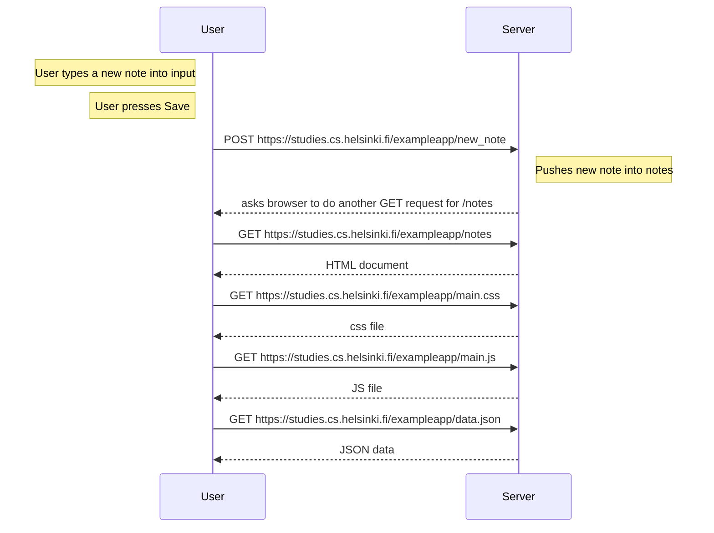

```mermaid
sequenceDiagram
participant User
participant Server

Note left of User: User types a new note into input
Note left of User: User presses Save
User->>Server: POST https://studies.cs.helsinki.fi/exampleapp/new_note
Note right of Server: Pushes new note into notes
Server-->>User: asks browser to do another GET request for /notes
User->>Server: GET https://studies.cs.helsinki.fi/exampleapp/notes
Server-->>User: HTML document
User->>Server: GET https://studies.cs.helsinki.fi/exampleapp/main.css
Server-->>User: css file
User->>Server: GET https://studies.cs.helsinki.fi/exampleapp/main.js
Server-->>User: JS file
User->>Server: GET https://studies.cs.helsinki.fi/exampleapp/data.json
Server-->>User: JSON data
```