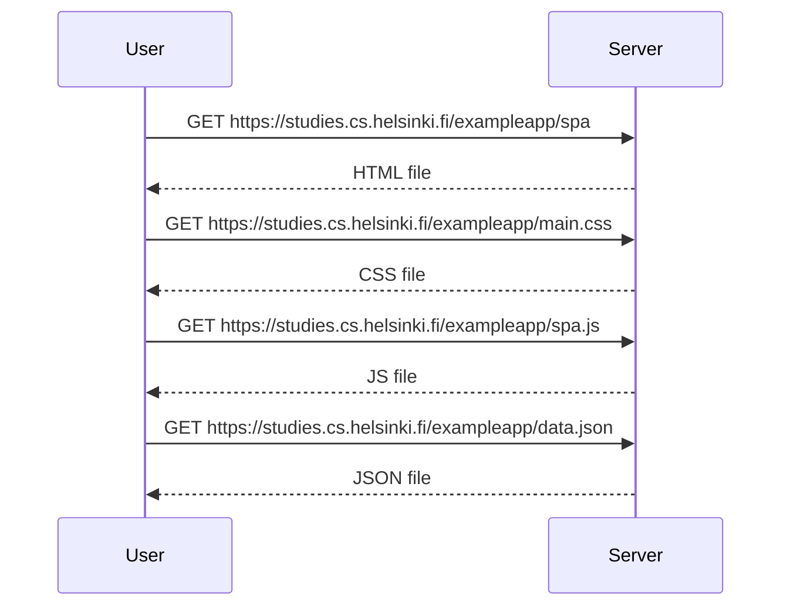

```mermaid

sequenceDiagram
participant User
participant Server

User->>Server: GET https://studies.cs.helsinki.fi/exampleapp/spa
Server-->>User: HTML file
User->>Server: GET https://studies.cs.helsinki.fi/exampleapp/main.css
Server-->>User: CSS file
User->>Server: GET https://studies.cs.helsinki.fi/exampleapp/spa.js
Server-->>User: JS file
User->>Server: GET https://studies.cs.helsinki.fi/exampleapp/data.json
Server-->>User: JSON file

```