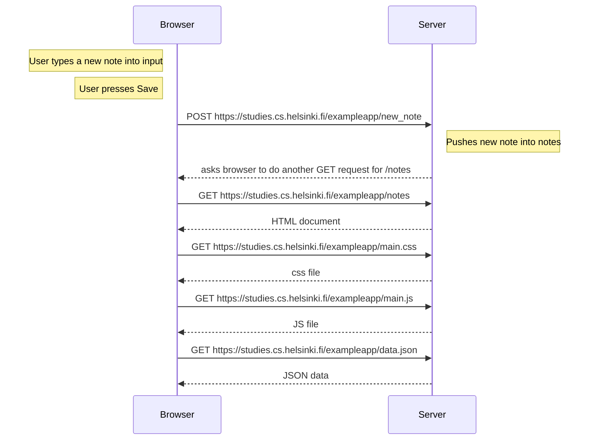

```mermaid
sequenceDiagram
participant Browser
participant Server

Note left of Browser: User types a new note into input
Note left of Browser: User presses Save
Browser->>Server: POST https://studies.cs.helsinki.fi/exampleapp/new_note
Note right of Server: Pushes new note into notes
Server-->>Browser: asks browser to do another GET request for /notes
Browser->>Server: GET https://studies.cs.helsinki.fi/exampleapp/notes
Server-->>Browser: HTML document
Browser->>Server: GET https://studies.cs.helsinki.fi/exampleapp/main.css
Server-->>Browser: css file
Browser->>Server: GET https://studies.cs.helsinki.fi/exampleapp/main.js
Server-->>Browser: JS file
Browser->>Server: GET https://studies.cs.helsinki.fi/exampleapp/data.json
Server-->>Browser: JSON data
```